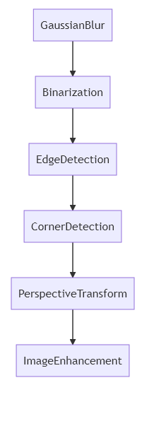

# a4_paper_scanner

converts untidy, rough document photographs into clean, rectangular form (A4 size) of image.
All algorithms are implemented as a function form.

## Process




## Core Algorithms

### [Square Tracing Algorithm](http://www.imageprocessingplace.com/downloads_V3/root_downloads/tutorials/contour_tracing_Abeer_George_Ghuneim/square.html) (Edges detection)

```c
Point GoLeft(Point p) { return Point(p.y, -p.x); }
Point GoRight(Point p) { return Point(-p.y, p.x); }
vector<Point> searchContour(Mat image)
{
	vector<Point> contourPoints;
	vector<Point> emptyPoints;
	// contour image (http://www.imageprocessingplace.com/downloads_V3/root_downloads/tutorials/contour_tracing_Abeer_George_Ghuneim/square.html)
	int height = image.size().height;
	int width = image.size().width;

	Point startPoint(-1, -1);
	setContourStartPoint(startPoint, image);

	if (startPoint.x == -1 && startPoint.y == -1)
	{
		//fail to detect any points	
		return contourPoints;
	}
	bool outPos=false;
	contourPoints.push_back(startPoint);
	Point nextStep = GoLeft(Point(1, 0));
	Point next = startPoint + nextStep;
	while (next != startPoint) {
		if (next.y <= 0 || next.y >= height|| next.x <= 0 || next.x >= width)
		{
			cout << "invalid position" << endl;
			outPos = true;
			break;

		}

		if (image.at<uchar>(next.y, next.x) == 0) {
			nextStep = GoRight(nextStep);
			next = next + nextStep;
		}
		else {
			contourPoints.push_back(next);
			nextStep = GoLeft(nextStep);
			next = next + nextStep;
		}
	}
	return contourPoints;
}

```

### [Ramer Douglas Peucker Algorithm](https://en.wikipedia.org/wiki/Ramer%E2%80%93Douglas%E2%80%93Peucker_algorithm) (Line simplification)

```c
double findPerpendicularDistance(Point p,Point p1, Point p2){
	double result;
	double slope;
	double intercept;
	if (p1.x == p2.x) {
		result = fabs(p.x - p1.x);
	}
	else {
		slope = (double)(p2.y - p1.y) / (double)(p2.x - p1.x);
		intercept = (double)p1.y - (slope * p1.x);
		result = fabs(slope * p.x - (double)p.y + intercept) / sqrt(pow(slope, 2) + 1.0);
	}
	return result;
}
vector<Point> rdp(vector <Point>v, int epsilon) {

	Point firstPoint = v[0];
	Point lastPoint = v[v.size() - 1];

	if (v.size() < 3) {
		return v;
	}
	int index = -1;
	double maxDist = 0;

	for (int i = 1; i < v.size() - 1; i++) {
		double cDist = findPerpendicularDistance(v[i], firstPoint, lastPoint);
		if (cDist > maxDist) {
			index = i;
			maxDist = cDist;
		}
	}
	if (maxDist > epsilon) {
		vector<Point> l1 = vector<Point>(v.begin(), v.begin() + index);
		vector<Point> l2 = vector<Point>(v.begin() + index, v.end());
		vector<Point> r1 = rdp(l1, epsilon);
		vector<Point> r2 = rdp(l2, epsilon);
		vector<Point> rs = r1;
		rs.insert(rs.end(), r2.begin(), r2.end());
		return rs;
	}
	else {
		vector<Point>a{ firstPoint, lastPoint };
		return a;
	}
	return v;
}
```

### [Perspective Transformation](https://en.wikipedia.org/wiki/3D_projection#Perspective_projection) (Plane image transformation)

```c
Mat getPerspectiveMatrix(vector<Point2f> src, vector<Point2f> dst)
{
	double a[8][8], b[8];
	Mat M(3, 3, CV_64F), X(8, 1, CV_64F, M.ptr());
	Mat A(8, 8, CV_64F, a),B(8, 1, CV_64F, b);
	for (int i = 0; i < 4; ++i)
	{
		a[i][0] = a[i + 4][3] = src[i].x;
		a[i][1] = a[i + 4][4] = src[i].y;
		a[i][2] = a[i + 4][5] = 1;
		a[i][3] = a[i][4] = a[i][5] = a[i + 4][0] = a[i + 4][1] = a[i + 4][2] = 0;
		a[i][6] = -src[i].x * dst[i].x;
		a[i][7] = -src[i].y * dst[i].x;
		a[i + 4][6] = -src[i].x * dst[i].y;
		a[i + 4][7] = -src[i].y * dst[i].y;
		b[i] = dst[i].x;
		b[i + 4] = dst[i].y;
	}
	Mat AInv = matrix_inv(A);
	Mat C = AInv  * B;
	for (int i = 0; i < 8; i++)
		M.ptr<double>()[i] = C.ptr<double>()[i];
	M.ptr<double>()[8] = 1.;
	return M;
}

Mat matrix_inv(Mat m) {

	double a[8][8], b[8][16];
	Mat inv(8, 8, CV_64F, Scalar(0));
	inv = 0;
	Mat n(8, 16, CV_64F, b);
	n = 0;
	int iter, i, j, k;

	double v;

	double tmp;
	int    max_key;
	iter = m.rows;

	for (j = 0; j < iter; j++)
		for (i = 0; i < iter; i++)
			b[j][i] = m.at<double>(j, i);

	for (i = 0; i < iter; i++)
		b[i][i + iter] = 1.0;

	for (i = 0; i < iter; i++) {
		max_key = i;
		for (j = i + 1; j < iter; j++)
			if (b[j][i] > b[max_key][i])
				max_key = j;
		if (max_key != i) {
			for (j = 0; j < iter * 2; j++) {
				tmp = b[i][j];
				b[i][j] = b[max_key][j];
				b[max_key][j] = tmp;
			}
		}
		v = b[i][i];
		for (j = i + 1; j < iter * 2; j++)
			b[i][j] /= v;

		for (j = i + 1; j < iter; j++) {
			v = b[j][i];
			b[j][i] = 0.0;
			for (k = i + 1; k < iter * 2; k++) {
				b[j][k] -= b[i][k] * v;
			}
		}
	}
	for (i = iter - 2; i >= 0; i--) {

		for (j = i; j >= 0; j--) {
			v = b[j][i + 1];
			for (k = 0; k < iter * 2; k++) {
				b[j][k] -= b[i + 1][k] * v;
			}
		}
	}
	for (j = 0; j < iter; j++)
		for (i = 0; i < iter; i++)
			inv.at<double>(j, i) = b[j][i + iter];
	return inv;
}

Mat perspectiveTransform(Mat image, Mat transformMatrix, Size size)
{
	int height = image.size().height;
	int width = image.size().width;
	Mat outputImage(size,image.type());
	int xp;
	int yp;
	for (int y = 0; y < height; y++)
		for (int x = 0; x < width; x++) {
			xp = (int)abs(((transformMatrix.at<double>(0, 0) * x + transformMatrix.at<double>(0, 1) * y + transformMatrix.at<double>(0, 2)) 
				/ (transformMatrix.at<double>(2, 0) * x + transformMatrix.at<double>(2, 1) * y + 1))); 
			yp = (int)abs(((transformMatrix.at<double>(1, 0) * x + transformMatrix.at<double>(1, 1) * y + transformMatrix.at<double>(1, 2)) 
				/ (transformMatrix.at<double>(2, 0) * x + transformMatrix.at<double>(2, 1) * y + 1)));
			if (yp >= 0 && yp < TARGET_HEIGHT && xp >= 0 && xp < TARGET_WIDTH)
			{
				outputImage.at<Vec3b>(yp, xp).val[0] = image.at<Vec3b>(y, x).val[0];
				outputImage.at<Vec3b>(yp, xp).val[1]=image.at<Vec3b>(y, x).val[1];
				outputImage.at<Vec3b>(yp, xp).val[2]=image.at<Vec3b>(y, x).val[2] ;
			}
		}
	return outputImage;
}

```